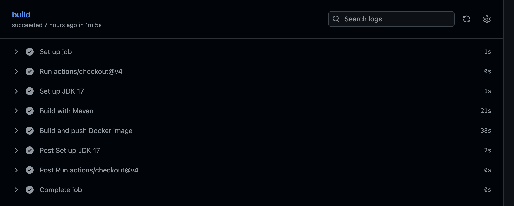
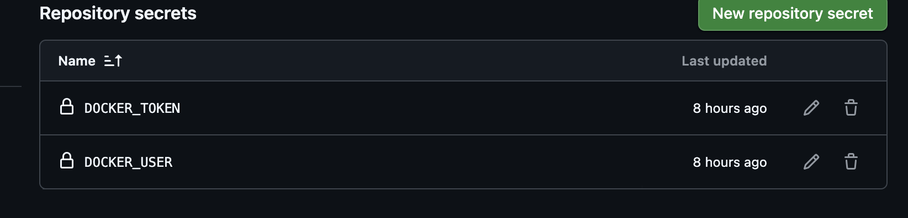
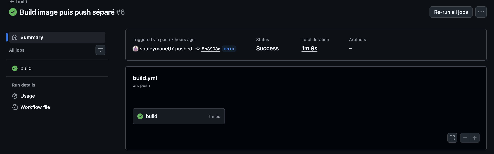
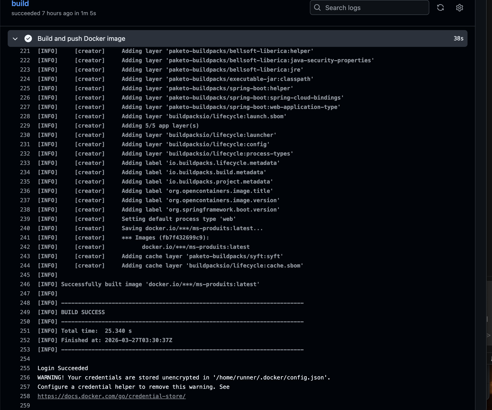
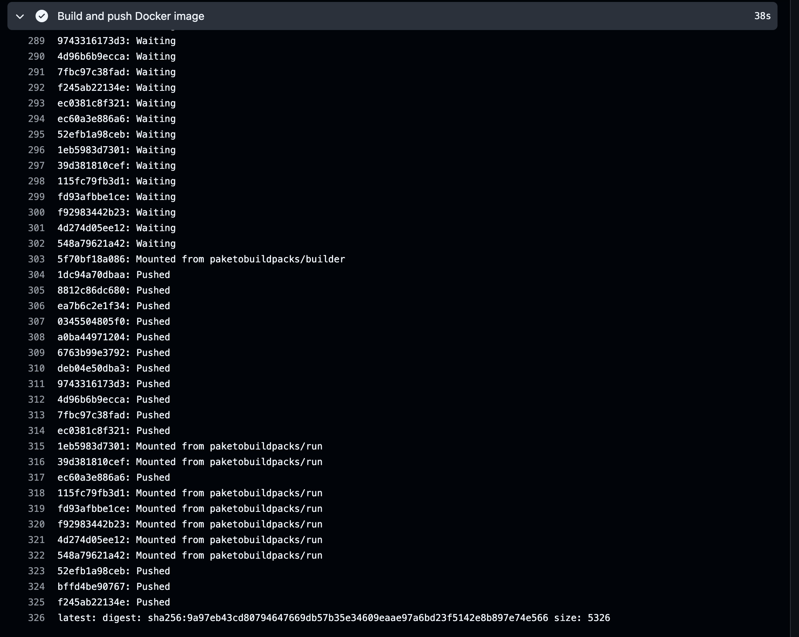
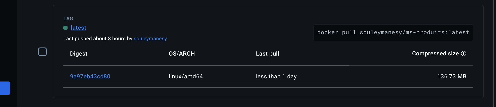

# TP DevOps - CI/CD avec GitHub Actions

## Projet
Microservice Spring Boot (gestion de produits) avec pipeline CI/CD automatisé sur GitHub Actions.

## Technologies utilisées
- Java 17 / Spring Boot 3.1.2
- Maven
- Docker / Docker Hub
- GitHub Actions

## Pipeline GitHub Actions

### Fichier de configuration (`.github/workflows/build.yml`)

Le workflow est déclenché à chaque push sur la branche `main` :

```yaml
name: build

on:
  push:
    branches: [ main, release ]
    paths-ignore:
      - '**/README.md'

jobs:
  build:
    runs-on: ubuntu-latest
    steps:
      - uses: actions/checkout@v4
      
      - name: Set up JDK 17
        uses: actions/setup-java@v4
        with:
          java-version: '17'
          distribution: 'temurin'
          cache: maven
          cache-dependency-path: '**/pom.xml'
      
      - name: Build with Maven
        run: mvn -B package
      
      - name: Build and push Docker image
        env:
          DOCKER_USER: ${{ secrets.DOCKER_USER }}
          DOCKER_PASSWORD: ${{ secrets.DOCKER_TOKEN }}
        run: |
          mvn spring-boot:build-image \
            -Dspring-boot.build-image.imageName=$DOCKER_USER/ms-produits:latest \
            -DskipTests
          echo $DOCKER_PASSWORD | docker login -u $DOCKER_USER --password-stdin
          docker push $DOCKER_USER/ms-produits:latest
```
### Déroulement du workflow


| **Set up JDK 17** | Installation de Java 17 avec cache Maven |
| **Build with Maven** | Compilation et packaging du projet (`mvn package`) |
| **Build and push Docker image** | Construction de l'image avec Buildpacks, puis push sur Docker Hub |



### Secrets configurés

Pour permettre le push sur Docker Hub, les secrets suivants ont été ajoutés dans **Settings > Secrets and variables > Actions** :

| `DOCKER_USER` | Nom d'utilisateur Docker Hub (`souleymanesy`) |
| `DOCKER_TOKEN` | Token d'accès personnel Docker Hub (Read & Write) |



### Exécution du workflow

Le workflow s'exécute automatiquement à chaque push sur la branche `main`.

#### Capture du workflow réussi


#### Détail des logs



### Image Docker

L'image est poussée sur Docker Hub avec le tag `latest` :

